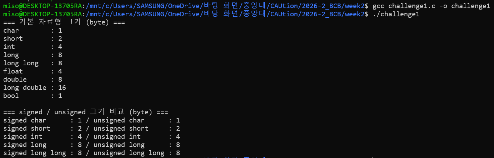
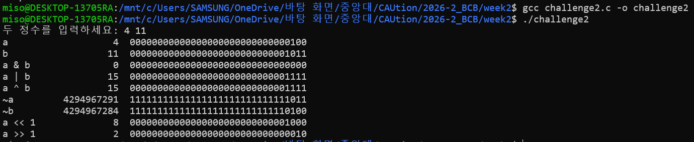
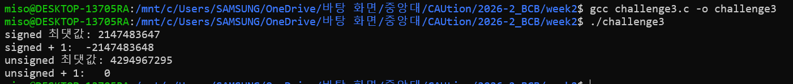
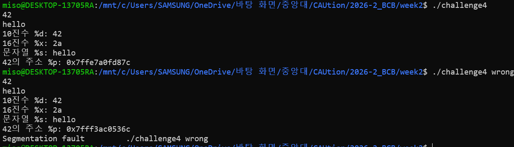

# Week 2

## Challenge 1. 자료형 크기 확인하기

### 실습 내용

`sizeof` 연산자로 C의 기본 자료형이 차지하는 메모리 크기를 확인하고, 정수형의 `signed`와 `unsigned` 크기를 비교했다.

### 실행 환경 및 방법

- 환경: Windows WSL (Linux)
- 컴파일러: GCC

```bash
#include <stdio.h>
#include <stdbool.h>

int main(void){
    printf("=== 기본 자료형 크기 (byte) ===\n");
    printf("char        : %zu\n", sizeof(char));
    printf("short       : %zu\n", sizeof(short));
    printf("int         : %zu\n", sizeof(int));
    printf("long        : %zu\n", sizeof(long));
    printf("long long   : %zu\n", sizeof(long long));
    printf("float       : %zu\n", sizeof(float));
    printf("double      : %zu\n", sizeof(double));
    printf("long double : %zu\n", sizeof(long double));
    printf("bool        : %zu\n", sizeof(bool));

    printf("\n=== signed / unsigned 크기 비교 (byte) ===\n");
    printf("signed char      : %zu / unsigned char      : %zu\n",
           sizeof(signed char), sizeof(unsigned char));
    printf("signed short     : %zu / unsigned short     : %zu\n",
           sizeof(signed short), sizeof(unsigned short));
    printf("signed int       : %zu / unsigned int       : %zu\n",
           sizeof(signed int), sizeof(unsigned int));
    printf("signed long      : %zu / unsigned long      : %zu\n",
           sizeof(signed long), sizeof(unsigned long));
    printf("signed long long : %zu / unsigned long long : %zu\n",
           sizeof(signed long long), sizeof(unsigned long long));

    return 0;
}
```

### 실행 결과

크기 단위는 byte이다.


### 결과 분석

자료형의 크기는 C 언어에서 모두 고정되어 있지 않으며, 사용하는 시스템과 컴파일러에 따라 달라질 수 있다. 이번 결과는 WSL의 Linux 환경에서 GCC로 컴파일해 확인한 값이다.

같은 정수형에서 `signed`와 `unsigned`의 크기는 같았다. 두 자료형은 사용하는 메모리 크기보다 **표현할 수 있는 값의 범위**에서 차이가 난다. `signed`는 음수와 양수를 표현하고, `unsigned`는 0 이상의 값만 표현한다.

## Challenge 2. 비트 연산 프로그램 작성

```bash
#include <stdio.h>
#include <limits.h>

void print_result(const char *name, unsigned int value)
{
    printf("%-10s %10u  ", name, value);

    size_t bits = sizeof(value) * CHAR_BIT;

    for (size_t i = bits; i > 0; i--) {
        putchar((value >> (i - 1)) & 1U ? '1' : '0');
    }

    putchar('\n');
}

int main(void){
    unsigned int a,b;

    printf("두 정수를 입력하세요: ");
    if(scanf("%u %u", &a, &b)!=2){
        return 1;
    }
    print_result("a", a);
    print_result("b", b);
    print_result("a & b", a & b);
    print_result("a | b", a | b);
    print_result("a ^ b", a ^ b);
    print_result("~a", ~a);
    print_result("~b", ~b);
    print_result("a << 1", a << 1);
    print_result("a >> 1", a >> 1);

    return 0;
}
```

### 실행 결과



## Challenge 3. Integer Overflow 실험

```bash
#include <stdio.h>
#include <limits.h>

int main(void){
    int signed_max = INT_MAX;
    unsigned int unsigned_max = UINT_MAX;

    int signed_result = signed_max + 1;
    unsigned int unsigned_result = unsigned_max +1;

    printf("signed 최댓값: %d\n", signed_max);
    printf("signed + 1:  %d\n", signed_result);

    printf("unsigned 최댓값: %u\n", unsigned_max);
    printf("unsigned + 1:   %u\n", unsigned_result);

    return 0;
}
```

### 실행 결과



### 결과 분석
`int`의 최댓값 `INT_MAX`에 1을 더했을 때는 실행 환경에서 음수가 출력되었다. 하지만 signed 정수의 오버플로우는 C 언어에서 정의되지 않은 동작이므로 항상 같은 결과가 나온다고 보장할 수 없다.

`unsigned int`의 최댓값 `UINT_MAX`에 1을 더한 결과는 0이었다. unsigned 정수는 표현 가능한 범위를 넘으면 0부터 다시 시작하도록 C 언어에서 정해져 있기 때문이다.


## Challenge 4. Format String 맛보기

```bash
#include <stdio.h>

int main(int argc, char *argv[]){

    int number = 42;
    char text[] = "hello";

    printf("%d\n", number);
    printf("%s\n", text);

    printf("10진수 %%d: %d\n", number);
    printf("16진수 %%x: %x\n", (unsigned int)number);
    printf("문자열 %%s: %s\n", text);
    printf("42의 주소 %%p: %p\n", (void*)&number);

    if(argc>1){
        fflush(stdout);
        printf("잘못된 포맷: %s\n", number);
    }

    return 0;

}
```

### 실행 결과



### 결과 분석
정수 `42`는 `%d`로 출력하면 10진수 `42`, `%x`로 출력하면 16진수 `2a`가 나왔다. `%s`는 문자열 `hello`를 출력했고, `%p`는 `number` 변수의 메모리 주소를 출력했다. 주소는 실행할 때마다 달라질 수 있다.

정수 `number`를 문자열용 지정자 `%s`로 출력하는 실험에서는 `Segmentation fault`가 발생했다. `%s`가 정수 값 `42`를 문자열의 주소로 해석해 접근하려 했기 때문이다. 잘못된 포맷 지정자를 사용한 결과는 보장되지 않으므로, 다른 환경에서도 반드시 같은 오류가 발생하는 것은 아니다.

