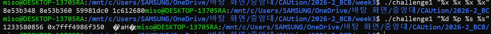
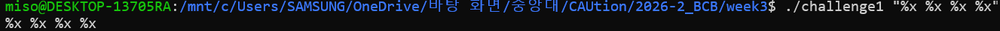
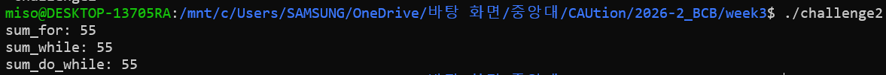
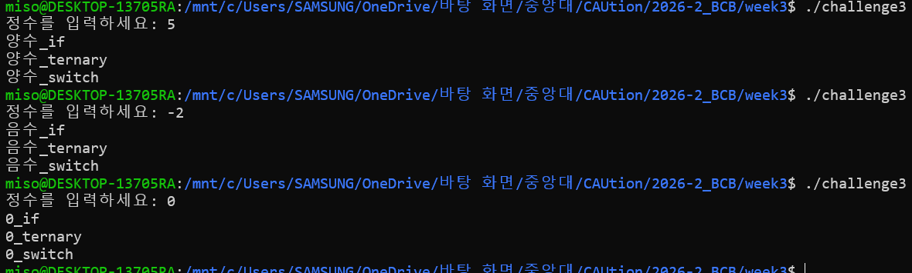
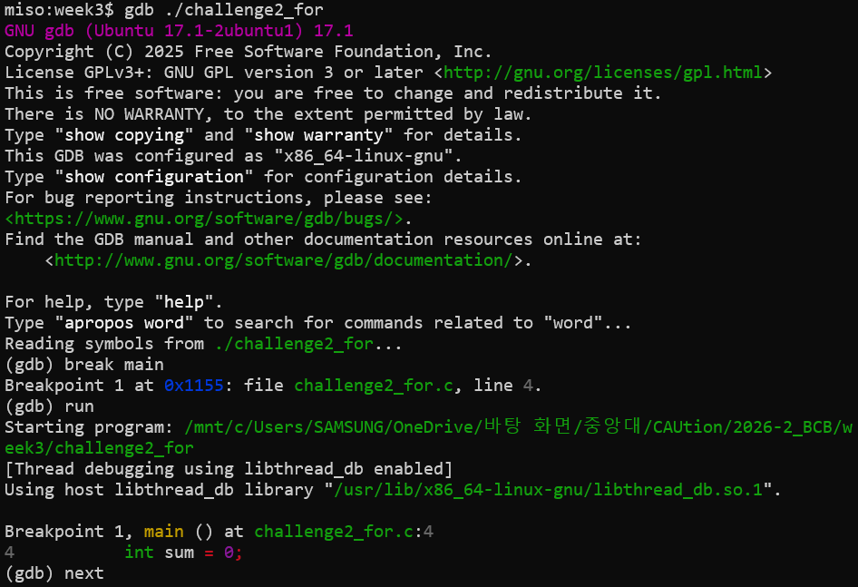
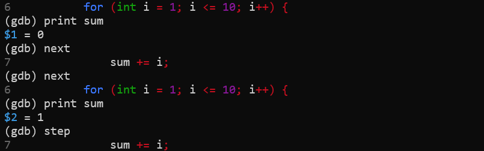
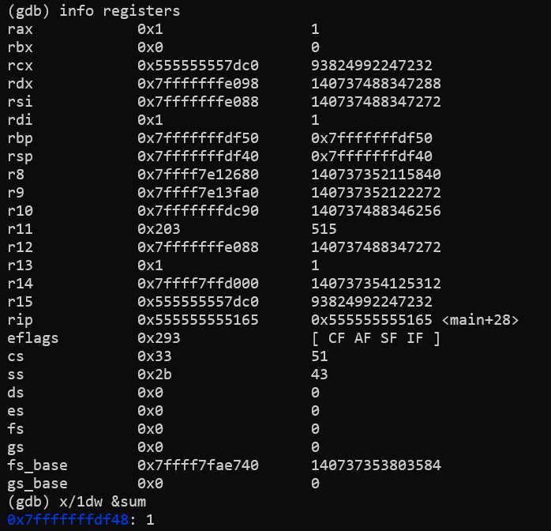
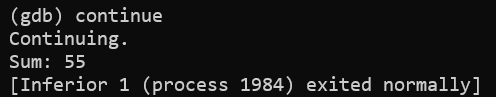

# Week 3

### 실행 환경

- 환경: Windows WSL (Linux)
- 컴파일러: GCC
- 
## Challenge 1. Format String Bug 실습

### 실습 코드

```bash
#include <stdio.h>
//취약한 코드
int main(int argc, char *argv[]) {
    printf(argv[1]);  // <- 인자를 포맷 스트링으로 직접 전달
}
```

```bash
#include <stdio.h>
//안전한 코드
int main(int argc, char *argv[]) {
    printf("%s\n", argv[1]);  // 사용자 입력을 문자열 데이터로 출력
}
```

### 실행결과
#### 취약한 코드

#### 안전한 코드


### 취약한 코드와 안전한 코드 비교, 이러한 현상이 발생하는 이유

다음 명령에서 큰따옴표로 묶은 문자열 전체는 프로그램의 인자 하나로 전달되어 `argv[1]`에 저장된다.

```bash
./challenge1 "%x %x %x %x"
```

취약한 코드인 `printf(argv[1]);`는 이번 실행에서 다음과 같이 동작한다.

```c
printf("%x %x %x %x");
```

`printf`는 첫 번째 인자를 포맷 문자열로 해석한다. 따라서 `%x`를 문자 그대로 출력하지 않고, **추가 인자에서 정수를 가져와 16진수로 출력하라는 지시**로 받아들인다.

정상적인 사용에서는 각 지정자에 대응하는 값을 전달해야 한다.

```c
printf("%x %x %x %x", 10, 20, 30, 40);
// 출력: a 14 1e 28
```

하지만 취약한 코드에는 해당 값들이 없다. 전달되지 않은 인자를 읽으려 하므로 **정의되지 않은 동작(undefined behavior)**이 발생한다. 실습에서는 레지스터나 스택에 남아 있던 값 등이 인자처럼 읽혀 의도하지 않은 숫자가 출력될 수 있다. 이 값들의 정확한 의미는 출력만으로 확정할 수 없으며, 실행 환경이나 실행 시점에 따라 결과가 달라질 수 있다.

| 지정자 | `printf`가 시도하는 처리 |
|---|---|
| `%x` | 값을 부호 없는 정수로 읽어 16진수로 출력 |
| `%d` | 값을 부호 있는 정수로 읽어 십진수로 출력 |
| `%p` | 값을 포인터로 읽어 주소 형태로 출력 |
| `%s` | 값을 문자열의 주소로 읽고, 해당 메모리의 문자열을 출력 |


반면 안전한 코드인 `printf("%s", argv[1]);`에서는 포맷 문자열이 `"%s"`로 고정되어 있고, 이에 대응하는 문자열 인자 `argv[1]`도 전달된다. **`argv[1]` 안의 `%x` 등은 다시 포맷 지정자로 해석되지 않으므로** 입력한 문자열이 그대로 출력된다.

## Challenge 2. 반복문 3종 비교
### 실습 코드
```bash
#include <stdio.h>

int main(){
    int sum_for = 0;
    int sum_while = 0;
    int sum_do_while = 0;


    for(int i = 1; i<=10; i++){
        sum_for += i;
    }

    int j = 1;

    while(j<=10){
        sum_while += j;
        j++;
    }

    int k = 1;

    do{
        sum_do_while += k;
        k++;
    }while(k <= 10);

    printf("sum_for: %d\n", sum_for);
    printf("sum_while: %d\n", sum_while);
    printf("sum_do_while: %d\n", sum_do_while);

    return 0;
}
```

### 실행결과


### for, while, do-while 차이점

| 반복문 | 코드 상의 차이점 | 적절한 사용 상황 |
|---|---|---|
| `for` | 초기화(`int i = 1`), 조건(`i <= 10`), 증가식(`i++`)을 한곳에 작성한다. 본문 실행 전에 조건을 검사한다. | 반복 횟수나 범위가 명확할 때|
| `while` | 초기화는 반복문 앞에, 증가식은 본문 안에 작성한다. 본문 실행 전에 조건을 검사한다. | 반복 횟수보다 특정 조건의 만족 여부가 중요할 때|
| `do-while` | 본문을 먼저 실행한 뒤 조건을 검사한다. 마지막 `while (조건)` 뒤에 세미콜론이 필요하다. | 조건과 관계없이 본문을 최소 한 번 실행해야 할 때|

## Challenge 3. 조건문으로 분기 구현
### 실습 코드
```bash
#include <stdio.h>

int main(){
    int num;
    printf("정수를 입력하세요: ");
    if (scanf("%d", &num) != 1) return 1;

    if(num > 0){
        printf("양수_if\n");
    }
    else if (num < 0){
        printf("음수_if\n");
    }
    else printf("0_if\n");

    printf("%s\n", (num > 0) ? "양수_ternary": (num <0) ? "음수_ternary" : "0_ternary");

    int sign = (num > 0) - (num < 0);

    switch (sign) {
        case 1:
            printf("양수_switch\n");
            break;
        case -1:
            printf("음수_switch\n");
            break;
        case 0:
            printf("0_switch\n");
            break;
    }


    return 0;
}
```

### 실행결과


## Challenge 4.
### 실습 코드

```bash
#include <stdio.h>

int main(void) {
    int sum = 0;

    for (int i = 1; i <= 10; i++) {
        sum += i;
    }

    printf("Sum: %d\n", sum);
    return 0;
}
```

### 실행결과






### GDB란?

GDB(GNU Debugger)는 프로그램의 실행을 중간에 멈추고, 코드를 단계별로 실행하면서 변수·레지스터·메모리 상태를 확인할 수 있는 디버깅 도구

### 실행 방법

```bash
# 실행 파일을 GDB로 열기
gdb ./challenge2_for
```
GDB가 시작된 뒤에는 `(gdb)` 프롬프트에서 아래 명령어를 입력한다.

### 주요 명령어

| 명령어 | 기능 |
|---|---|
| `break` |  중단점을 설정한다. 실행이 해당 위치에 도달하면 멈춘다. |
| `run` |  프로그램을 처음부터 실행한다. |
| `next` |  소스 코드 한 줄 단위로 진행한다. 함수 호출은 내부로 들어가지 않고 실행한다. |
| `step` | 소스 코드 한 줄 단위로 진행한다. 함수 호출 시 디버깅 정보가 있으면 내부로 들어갈 수 있다. |
| `print` |  변수나 표현식의 현재 값을 출력한다. |
| `info registers` | CPU 레지스터의 현재 값을 확인한다. |
| `x/` |  지정한 주소의 메모리 내용을 확인한다. |
| `continue` | 다음 중단점이나 프로그램 종료까지 실행을 계속한다. |
| `finish` | 현재 함수를 끝까지 실행하고 호출한 곳으로 돌아온다. |
| `quit` | GDB를 종료한다. |


### 변수와 메모리 확인하기

반복문에서 실행을 멈춘 뒤 다음 명령어로 변수 값을 확인한다.

```gdb
print i
print sum
```

예를 들어 첫 번째 덧셈 직전에는 `i = 1`, `sum = 0`이고, 덧셈을 실행한 뒤에는 `sum = 1`이 된다. 두 번째 덧셈을 실행하면 `sum = 3`이 된다.

메모리에 저장된 `sum`의 값을 확인하려면 다음 명령어를 사용한다.

```gdb
x/1dw &sum
```

| 구성 요소 | 의미 |
|---|---|
| `x` | 메모리 검사 |
| `1` | 데이터 1개 확인 |
| `d` | 십진수로 표시 |
| `w` | 4바이트 단위로 읽기 |
| `&sum` | `sum`이 저장된 메모리 주소 |

동일한 메모리 내용을 16진수로 확인하려면 다음과 같이 입력한다.

```gdb
x/1xw &sum
```

변수와 메모리, 레지스터 확인은 프로그램이 종료되기 전에 실행이 멈춘 상태에서 진행한다.
