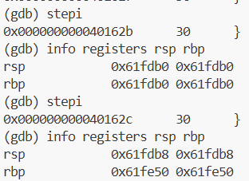
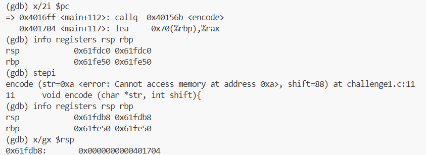
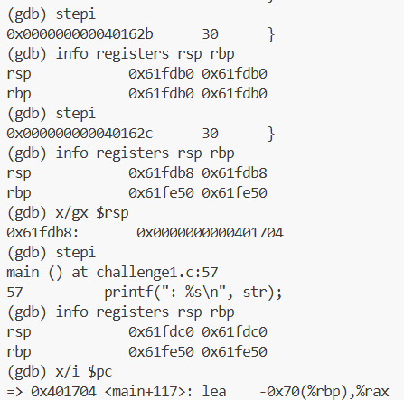

스택 프레임: 함수가 호출될 때마다 메모리의 스택 영역에 생성되는 함수 호출 정보의 저장 단위 
Ex. 리턴 주소(ret), 베이스 포인터(rbp) 
 

: stepi를 실행해서 다음 명령어 위치로 이동하면서 스택에 저장되어 있던 main의 rbp를 꺼내 rbp를 복원했고, 꺼낸 만큼 rsp는 8바이트 증가. 

: call 실행 후 rsp가 8바이트 감소했으며 x/gx $rsp=0x401704로 스택 맨 위에 들어간 값이 call 다음 명령어 주소와 같음. 

: add, pop, retq 를 순서대로 실행한 뒤, rsp와 rbp 값이 call 실행 전 값과 같으며 x/i $pc = 0x401704 <main+117>로 스택에서 꺼낸 리턴 주소로 이동했음. 